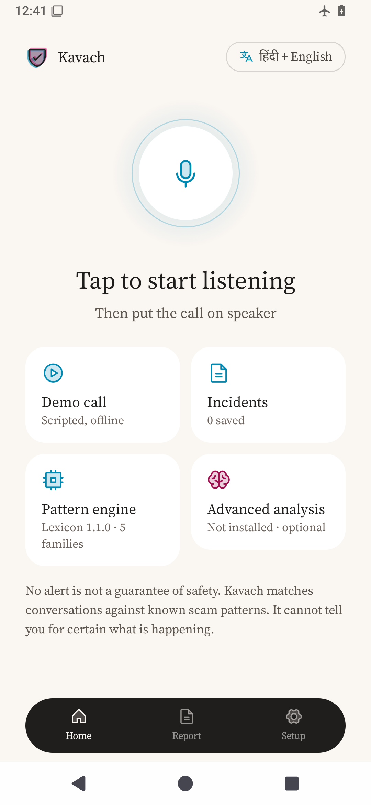
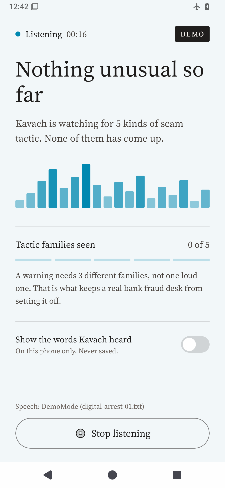
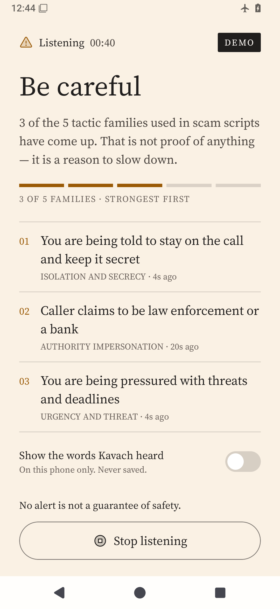
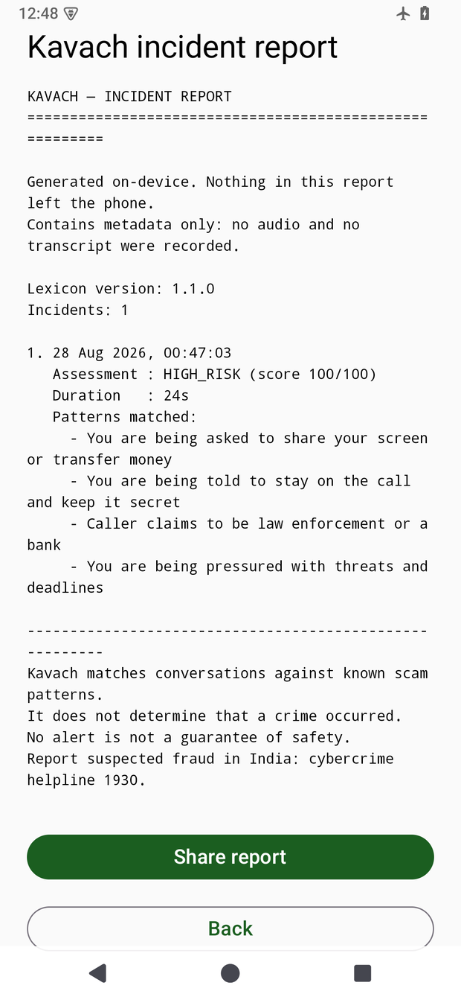
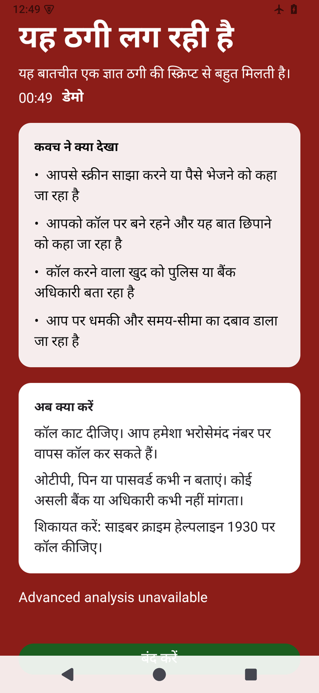

# KAVACH (कवच) 🛡️

**On-Device Real-Time Scam Call Detection for India’s 99% Android Ecosystem.**  
*100% Offline · Zero Network Permission · Hindi, Hinglish & English · 180-marker Deterministic Engine, 0% False Positives*

[](https://github.com/Atul-Chahar/KAVACH_IQOO)
[-blue?style=flat-square)](#-zero-internet-privacy-guarantee)
[](#-code-switched-multi-language-speech-pipeline)
[](#-optimized-for-iqoo-15--snapdragon-8-elite)
[](LICENSE)

---

## ✅ Verify every claim in this README — one command, no device

```bash
./scripts/verify-claims.sh
```

Prints 31 claims with their **measured** values and exits non-zero if any one of
them has stopped being true: the privacy invariants, the architecture rules, the
lexicon numbers, and both accuracy corpora. Takes about a minute.

**[`docs/EVALUATION.md`](docs/EVALUATION.md) maps every hackathon judging
criterion to the exact file or command that proves it** — including an honest
list of what we did *not* build, and the one component that is integrated but
switched off. If a number anywhere disagrees with that file, that file is right.

---

## 🎯 The Pitch in One Line

> **Google launched on-device AI scam-call detection, then locked it to Pixel 9+ (less than 1% of India’s smartphone market). KAVACH brings zero-latency, zero-cloud scam protection to the other 99% — running natively on iQOO 15 and Snapdragon 8 Elite hardware in Hindi, Hinglish, and English.**

---

## ⚡ The Problem & The Solution

India lost **₹22,495 crore to cybercrime in 2025**, up 24% year on year. "Digital arrest" scams alone took **₹109 crore across 641 cases in Karnataka — ₹42.41 crore of it from 480 cases in Bengaluru**. The scripts are consistent: fake **CBI/Police extortion**, **customs parcel** seizures, **electricity disconnection** threats, and **urgent UPI/OTP traps**. *(Sources in [`docs/PRD.md`](docs/PRD.md) §2.)*

Traditional spam filters (Truecaller, Google Phone) only look at static caller ID databases — they are completely blind the moment a scammer calls from an unflagged VoIP or spoofed number.

**KAVACH listens to the conversation in real time, entirely on-device, and raises an emergency shield the moment the caller’s script matches known psychological scam tactics.**

```
                                  KAVACH LIVE DEFENSE PIPELINE
┌─────────────────┐       ┌────────────────────────┐       ┌──────────────────────────────┐
│  Live Call Audio│ ────► │ Piped Mic Capture Pipe │ ────► │ Dual-Language On-Device ASR  │
│ (VoIP / Cellular│       │ (Accessibility Exemption│      │ (hi-IN Devanagari + en-IN)   │
└─────────────────┘       └────────────────────────┘       └──────────────┬───────────────┘
                                                                          │
                                ┌─────────────────────────────────────────┴───────────────┐
                                │                                                         │
                                ▼                                                         ▼
                 ┌─────────────────────────────┐                           ┌─────────────────────────────┐
                 │  Tier 1: Tactic Lexicon     │                           │  Tier 2: LiteRT-LM (Gemma)  │
                 │  • 5 Tactic Families        │                           │  • Integrated + schema-safe │
                 │  • 180 markers + 40 guards  │                           │  • ⚠ GATED OFF in this build│
                 │  • Sub-millisecond Latency  │                           │  • Tier 1 carries the app   │
                 └──────────────┬──────────────┘                           └──────────────┬──────────────┘
                                │                                                         │
                                └─────────────────────────┬───────────────────────────────┘
                                                          ▼
                                           ┌─────────────────────────────┐
                                           │ Merged Risk Engine          │
                                           │ • Diversity Bonus Score     │
                                           │ • Time Decay (120s t½)      │
                                           └──────────────┬──────────────┘
                                                          ▼
                                           ┌─────────────────────────────┐
                                           │ Non-Intrusive Call Shield   │
                                           │ Green ➔ Amber ➔ Red (1930)  │
                                           └─────────────────────────────┘
```

---

## 🚀 Key Innovations & Architecture

### 1. 🔒 Zero-Internet Privacy Guarantee
* **No `android.permission.INTERNET`**: KAVACH contains **zero network access permissions**. It is physically impossible for the app to send private call audio or transcripts to any server.
* **Audio Never Touches Disk**: Audio is processed entirely in memory via circular PCM16 ring buffers and piped directly to on-device recognizers through `ParcelFileDescriptor` pipes.
* **Automated CI Guard**: Gradle builds fail immediately via `:app:assertNoInternetPermission` if any dependency attempts to pull in internet permissions.

### 2. 🎙️ In-Call Live Microphone Capture (Accessibility Exemption)
Android mutes normal third-party apps from recording audio while a phone call is active (`MODE_IN_CALL` / `MODE_IN_COMMUNICATION`). KAVACH solves this through a documented architectural mechanism:
* An **Accessibility Service** registers KAVACH's UID for ambient assistance.
* KAVACH opens `AudioRecord` under its own UID and feeds the speech recognizer via a `ParcelFileDescriptor` pipe using `RecognizerIntent.EXTRA_AUDIO_SOURCE`.
* The recognizer never holds the microphone itself, ensuring capture is never silenced mid-call.

### 3. 🇮🇳 Code-Switched Multi-Language Speech Pipeline (Hindi + Hinglish + English)
Indian scam calls are heavily code-switched: combining Hindi verbs, English nouns, and romanized jargon (*"Main CBI officer bol raha hoon, aapka account block ho jayega, OTP share kijiye"*).
* KAVACH rotates speech recognition between **`hi-IN` (Hindi Devanagari)** and **`en-IN` (Indian English / Latin Hinglish)** at every utterance boundary.
* Integrated with Android 14+ (API 34/35) `SpeechRecognizer.triggerModelDownload()` and `checkRecognitionSupport()` to dynamically download and manage on-device models on OEM devices like iQOO 15 without confusing settings menus.

### 4. 🧠 Dual-Tier Hybrid AI Engine
* **Tier 1 (Deterministic Lexicon Engine)** — this is what ships and what every number below measures:
  * **5 tactic families**: `AUTHORITY_IMPERSONATION`, `ISOLATION_AND_SECRECY`, `URGENCY_AND_THREAT`, `CREDENTIAL_EXTRACTION`, `REMOTE_ACCESS_AND_TRANSFER`.
  * **180 markers** carrying English, romanised Hinglish and Devanagari forms side by side, plus **40 negative guards** that *subtract* score — the phrases a real bank, officer or courier uses and a scammer avoids. Provenance (I4C, PhonePe Trust & Safety, Seqrite, RBI advisories) is recorded in `data/tactic_lexicon.json`. No private or field data.
  * **Tactical Diversity Rule**: HIGH_RISK requires score ≥ 70 **and at least 3 distinct families** firing together. One loud keyword can never raise an alarm — which is why a real courier asking for a real delivery OTP stays silent.
  * Exponential time decay ($t_{1/2} = 120\text{s}$) prevents ancient conversation context from lingering.
* **Tier 2 (LiteRT-LM Gemma On-Device LLM)** — ⚠️ **integrated but switched off in this build**:
  * Model catalogue, import, Adreno GPU backend and schema-validated JSON verdicts are all wired, with a silent fallback to Tier 1 on any parse failure.
  * It is disabled (`KavachApplication.kt`, `TIER2_ENABLED = false`) because LiteRT-LM 0.16.1 and kotlinx-coroutines 1.9–1.10 disagree on where `SendChannel.close$default` lives; the first completed inference throws `NoSuchMethodError` on LiteRT-LM's own JNI thread, outside any coroutine we own, and the process dies mid-call.
  * An adjudicator that kills the app during a scam call is strictly worse than no adjudicator. **Every accuracy number in this README is Tier 1 alone.** Full detail in [`docs/EVALUATION.md`](docs/EVALUATION.md) §7.

### 5. 💬 Message Guard — the same engine, on the other door
Scam scripts arrive by SMS and RCS too, and reach people who never answer an unknown number.
* A `NotificationListenerService` reads **incoming message notifications only** — filtered to known messaging apps plus the device's resolved default SMS app. KAVACH holds **no `READ_SMS` permission** and never touches the SMS database.
* The same Tier-1 lexicon scores the text, on `Dispatchers.Default`. The listener callback arrives on the **main thread**, so it copies the strings and returns in under a millisecond — anything heavier there stalls the UI, and during a call it would stall the very Activity that keeps the microphone alive.
* The warning is **self-contained**: it names the conversation, gives the two worst reasons in plain words, and carries **Call 1930** and **This is fine** as actions. It is readable and actionable **from the lock screen** — you never open KAVACH to resolve one.
* On an unlocked screen a HIGH_RISK finding raises a **Dynamic Island capsule** — a `TYPE_APPLICATION_OVERLAY` window with `FLAG_NOT_TOUCH_MODAL`, so it pauses nothing and the phone stays fully usable underneath it. Never a full-screen takeover: a text message is not a live call.
* **Message text is never stored.** Only the conversation name, the time, and the warning categories, in memory, until the process ends. Messages KAVACH clears are not recorded at all.

---

## 📱 App Walkthrough & UI Progression

KAVACH is designed to be calm, legible at arm's length (18sp+ typography), and free of panic sirens:

<p align="center">
  
  
  
</p>

| State | Indicator | Trigger Condition | User Action |
|---|---|---|---|
| **WATCHING** | 🟢 Calm Dot | Call connected, 0–1 tactics detected | Touch passes through to call; no disruption |
| **CAUTION** | 🟡 Amber Banner | Score ≥ 40 | Highlights identified tactics; advises caution |
| **HIGH RISK** | 🔴 Red Shield | Score ≥ 70 **and** 3+ distinct families | Names the tactics, offers **Call 1930**, and advises hanging up — KAVACH never hangs up for you |

<p align="center">
  
  
  
</p>

---

## 📊 Benchmark & Accuracy

Measured on the KAVACH corpus — digital arrest, customs parcel, TRAI disconnection, electricity cutoff, lottery, refund/remote-access, relative-arrested and OTP phishing, in English, Hinglish and Devanagari — against legitimate police, bank, courier and family calls. **These are the numbers the tests print; nothing here is rounded up.**

| Path | Corpus | Detection | False positives |
|---|---|---|---|
| **Calls** | 10 scam / 8 legitimate | **10/10 reached HIGH_RISK** | **0% (0/8)** — none reached even CAUTION |
| **Messages** | same corpus, message path | **10/10 flagged** | **0% (0/8)** |
| **Latency** | 10 scam scripts | fastest **24 s** of speech to HIGH_RISK | budget 42 s |

The negative corpus is deliberately unkind: it contains a real courier asking for
a real delivery OTP, a real bank asking for a KYC update, a real fraud desk
discussing a real transaction, and a father and son *talking about* OTP scams.
Each says what a scammer says; each stays silent.

*Re-verify anytime:*
```bash
./scripts/verify-claims.sh                                 # everything, one command
./gradlew :domain:test --tests "*FixtureCorpusTest*" -i     # calls
./gradlew :domain:test --tests "*SmsCorpusTest*"     -i     # messages
```

---

## 🛠️ Quick Start & Installation

### Prerequisites
* **Android Device**: Android 11+ (`minSdk 30`) — *developed and verified on iQOO I2501, Android 16*.
* **JDK**: JDK 21 (Toolchain pinned).
* **Android SDK**: `compileSdk = 35`, `targetSdk = 35`.

### 1. Clone & Build
```bash
git clone https://github.com/Atul-Chahar/KAVACH_IQOO.git
cd KAVACH_IQOO

# Run full quality check & tests
./gradlew check

# Build debug APK
./gradlew assembleDebug
```

### 2. Install on Device
```bash
# Enable USB Debugging on your phone, then run:
export ANDROID_HOME=$HOME/Android/Sdk
export PATH=$ANDROID_HOME/platform-tools:$PATH

adb install -r -g app/build/outputs/apk/debug/app-debug.apk
```

### 3. One-Click Device Smoke Test
```bash
./scripts/device-check.sh
```
*Validates device chipset, grants necessary accessibility & overlay appops, checks Google on-device ASR availability, and launches the app.*

### 4. Verify the claims (no device needed)
```bash
./scripts/verify-claims.sh
```
*Measures all 31 claims this README makes and exits non-zero if any is false.*

---

## 🧪 Testing Live Voice on iQOO 15

1. Open **KAVACH** on the phone.
2. Tap **"Start listening"** (or receive a real phone / WhatsApp call).
3. Speak a standard multi-tactic scam line aloud in Hindi or Hinglish:
   > *"Main CBI head office se bol raha hoon. Aapke naam par illegal narcotics parcel mila hai aur arrest warrant issue hua hai. Kisi ko mat batana, apna bank account verify karne ke liye OTP bataiye."*
4. Watch the live score climb from **Green (0) ➔ Amber (40) ➔ Red (80+)** and raise the **Call 1930** emergency alert.

---

## 🏗️ Project Structure

```
KAVACH/
├── app/                  # Android Application Module (Jetpack Compose UI, ASR, Capture, LiteRT-LM)
│   ├── src/main/kotlin/  # Live pipeline, speech recognizer, shield overlay
│   └── src/test/         # 14 unit tests for ASR, model and Message Guard state
├── domain/               # Pure Kotlin JVM Module (Zero Android SDK dependencies)
│   ├── src/main/kotlin/  # RiskEngine, TacticMatcher, SignalAggregator, Lexicon
│   └── src/test/         # 122 unit tests: decay maths, lexicon and corpus regressions
├── demo/                 # Deterministic fixture replay engine for airplane mode demos
├── data/
│   └── tactic_lexicon.json # Single source of truth for scam tactics & weights
└── fixtures/             # Positive (scams) and negative (benign calls) test scripts
```

---

## 🏆 iQOO Hackathon 2026

* **Track**: FinTech and Commerce
* **Judging evidence**: [`docs/EVALUATION.md`](docs/EVALUATION.md) — every criterion mapped to a command that proves it
* **Team**: **Kavach** (*Atul Chahar & Anant Sharma*)
* **Repository**: [https://github.com/Atul-Chahar/KAVACH_IQOO](https://github.com/Atul-Chahar/KAVACH_IQOO)
* **Official Hackathon Portal**: [iQOO Reskilll Hackathon](https://iqoo.reskilll.com/)

---

## 📜 License

Licensed under the **Apache License, Version 2.0**. See the [LICENSE](LICENSE) file for details.
